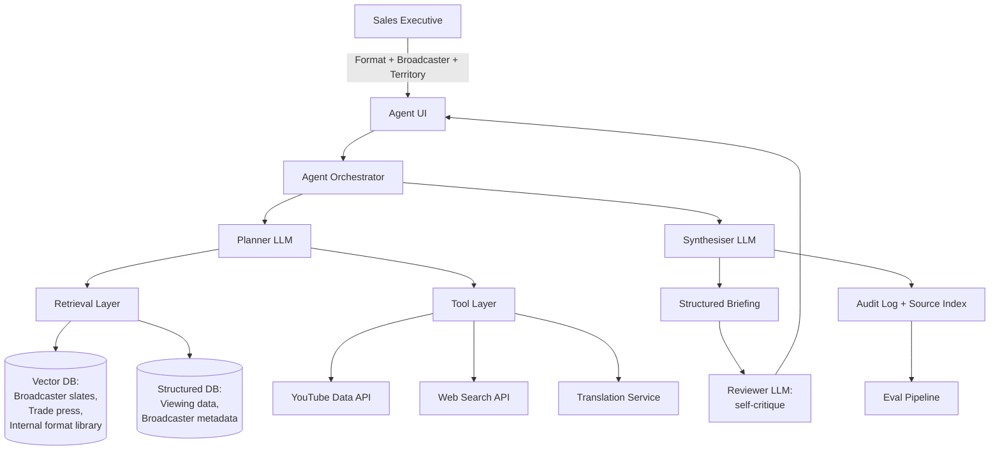

# Retrieval-Augmented Agent
## A worked example of production AI architecture, evaluation and governance

**Document type:** Product Requirements and System Architecture (worked example)
**Audience:** Anyone evaluating how a senior AI Product Manager scopes, designs, evaluates and governs a production retrieval-augmented agent
**Author:** Michael, Ai Senior Product Manager (Data and AI Platform)
**Status:** Public v1.0
**Lifecycle stage:** Gate 3 (Investment Case approved, entering Build)

---

## About this document

This is a worked example of how I would specify a production retrieval-augmented agent end to end. It uses a fictional studios business (MetroStudios) and a fictional sales-research use case so the decisions feel real rather than abstract. The architecture, the evaluation framework, the human-in-the-loop pattern, and the FinOps thresholds are domain-agnostic. The same shape, plan, retrieve, synthesise, review, applies to a deal-screening agent in a bank, a literature-review agent in pharma, a tier-1 support agent in B2B SaaS, or a research agent embedded in a frontier lab's enterprise deployment.

How to read it by interest:

- If you care about **architecture decisions**, sections 3 and 4 cover the functional specification and the plan-retrieve-synthesise-review pattern, and section 7 covers the constrained agent loop.
- If you care about **retrieval engineering**, sections 5 and 6 cover data sources, source tiering, hybrid retrieval, and reranking.
- If you care about **evaluation discipline**, section 8 covers the three-level eval framework and the Gate 4 thresholds.
- If you care about **responsible AI and governance**, section 9 covers EU AI Act classification, the HITL pattern, audit, observability, and kill switches.
- If you care about **unit economics and reliability**, section 10 covers the non-functional requirements and section 13 covers risks and mitigations.

---

## 1. Problem Statement

I keep seeing the same pattern across enterprises, and it is one of the highest-value places to put generative AI. A knowledge worker spends one to two days assembling a structured research artefact from scattered sources. The quality varies by seniority. There is no audit trail tying the final claims back to the evidence. The same shape shows up in pre-pitch research, pre-meeting briefings, deal screening, due-diligence summaries, regulatory submissions, and competitor analysis.

This agent compresses that research into a structured, citation-bound briefing the user can review, refine, and act on in under 20 minutes. Every claim is traceable to a source. The shape of the architecture and the discipline of the evaluation framework are the portable lessons here. The worked example below uses a fictional studios business so the decisions stay concrete rather than abstract.

**Worked example.** MetroStudios' International Sales team pitches around 200 content formats per year to broadcasters and platforms across more than 80 territories. Before any pitch, a sales executive spends an average of 1.5 working days on market research: pulling viewing trends, identifying competing formats, reviewing the broadcaster's current slate, and assembling a one-page briefing. The quality varies wildly between executives. The most senior people produce strong briefings in three hours. New joiners take two days and miss commercially relevant signals. The Sales Market Intelligence Agent is the instantiation of the pattern for this specific use case.

## 2. User and Jobs to Be Done

The pattern is consistent. An expert practitioner, whether a sales executive, a deal screener, an analyst, or a researcher, is preparing for a high-stakes external interaction. A pitch, a meeting, a recommendation. They need a structured, evidence-bound briefing that compresses one to two days of fragmented research into 20 minutes of review. A second user, a manager or a director, needs the same briefing in a consistent format so they can challenge assumptions quickly across many cases.

**Worked example.**

**Primary user:** International Sales executives at MetroStudios, around 60 people across the UK, US, and Singapore hubs.

**Primary job to be done:** "When I am preparing to pitch a format to a broadcaster, I want to quickly understand the broadcaster's current slate, their territory's viewing trends, and what competing formats are gaining or losing traction, so that I can tailor my pitch and walk in credible."

**Secondary user:** Sales Directors who review briefings before high-value pitches.

**Secondary job to be done:** "When I am reviewing a junior executive's pitch preparation, I want a consistent briefing format with traceable evidence, so that I can challenge assumptions quickly."

---
## 3. Functional Specification

### 3.1 Inputs

The agent takes three inputs. The format the user intends to pitch, selected from the internal catalogue. The target broadcaster or platform, selected from a maintained list of around 500 entities. And the territory, which defaults to the broadcaster's primary territory but can be overridden.

### 3.2 Output

A structured market briefing with seven sections:

1. **Territory snapshot:** TV consumption trends, AVOD versus SVOD split, peak slots.
2. **Broadcaster slate:** current programming, recent commissions, gaps in the schedule.
3. **Competing formats:** what is running, what is winning, what is being cancelled, what is being remade.
4. **Trend signals:** three to five signals from YouTube, social, and trade press indicating audience appetite.
5. **Format fit:** a reasoned argument for why this format suits this broadcaster and territory now.
6. **Risks and counterarguments:** what the broadcaster is likely to push back on, with prepared responses.
7. **Sources:** every claim in sections 1 to 6 is cited.

### 3.3 Non-goals (v1)

I drew the v1 line deliberately. The agent does not generate pitch decks. It does not negotiate or model deal terms. It does not access the internal sales CRM, which is deferred to v2 pending a data governance review. And it does not produce briefings for non-scripted formats such as sport and news. Drama, factual, and entertainment only.

## 4. System Architecture

The architecture follows a plan-retrieve-synthesise-review pattern. I separated it into distinct LLM calls on purpose, so each one can be evaluated independently.

### 4.1 Layer by layer

The **Agent UI** is a lightweight React app embedded in the Sales hub. The **Agent Orchestrator** is a stateful workflow manager. It owns the per-request trace ID, manages retries and timeouts, and persists every intermediate state for auditability.

The **Planner LLM** decomposes the briefing into the seven sections, decides which retrieval queries and tool calls each section needs, and produces an explicit plan that is logged. The **Retrieval Layer** runs hybrid retrieval, semantic and keyword, over the Vector DB, with structured queries against the Structured DB. It returns ranked, deduplicated, source-attributed snippets. The **Tool Layer** is a set of stateless wrappers around external APIs. Each tool has its own rate limiting, caching, and failure-mode handling.

The **Synthesiser LLM** composes the briefing from the retrieval results and tool outputs. It is constrained to cite every factual claim against a source ID. The **Reviewer LLM** is a separate model instance that critiques the synthesiser's output against the eval rubric before the briefing reaches the user. Failures route back to the synthesiser for one retry, then surface as a quality warning. The **Eval Pipeline** runs on every production briefing at a configurable sampling rate, and on the offline golden set nightly.

### 4.2 Why this shape

Three architectural choices here, and I can defend each one at a senior review. These are the portable lessons that survive any change of domain.

**Separate the planner, the synthesiser, and the reviewer.** Combining them into a single agentic loop produces a faster demo, but it is impossible to evaluate at component level. Separating them means I can attribute a failure. Was it the plan? The retrieval? The synthesis? The review? I can then improve the component that broke without regressing the whole. This generalises to any multi-step agent. Optimise for component-level evaluability over end-to-end elegance.

**Hybrid retrieval, not pure vector.** Sales executives ask questions like "what did Channel 4 commission in the last six months in the 9pm Sunday slot?" That is a structured query, not a similarity search. Pure RAG would hallucinate an answer. Hybrid retrieval routes structured questions to structured data. The same routing logic applies to any domain that mixes structured facts, such as deal terms, lab results, or financial filings, with unstructured context such as analyst notes, news, or research papers.

**Explicit citation at synthesis time.** The synthesiser is prompted and constrained, through structured output, to attach a source ID to every claim. The Reviewer LLM rejects any claim without a citation. This is the single most important design decision for trust. It is what makes the output defensible in any regulated industry, whether that is financial advice, medical research, legal discovery, or employment decisions. And it is what separates a production agent from a demo.

---
## 5. Data Sources

|Source|Type|Refresh|Access|Risk|
|---|---|---|---|---|
|Broadcaster slate database (internal)|Structured|Daily|Internal API|Low|
|Trade press archive (Variety, Deadline, Broadcast, C21)|Unstructured|Daily|Licensed feeds|Medium (licence terms)|
|YouTube Data API|API|On-demand|Public|Low (rate limits)|
|Viewing data (BARB, Nielsen, EU equivalents)|Structured|Weekly|Licensed|High (commercial sensitivity)|
|MetroStudios format library|Structured|Manual|Internal API|Low|
|Web search (trend signals beyond trade press)|API|On-demand|Tavily/Brave|Medium (source quality)|

**Source quality policy.** Every source carries a tier. T1 is licensed and authoritative, T2 is trade press, T3 is open web. The synthesiser must indicate the tier of each citation. Any briefing with more than 30% T3 citations is flagged for senior review. I set that threshold because the open web is where a confident-sounding but weak claim is most likely to slip in, and a sales executive walking into a pitch needs to know how solid the ground under each claim is.

## 6. Retrieval Strategy

### 6.1 Indexing

Trade press, broadcaster slates, and the format library are chunked and embedded weekly. Chunks are sized to 500 tokens with a 50-token overlap. Each chunk is enriched with metadata: source, publication date, territory, genre, broadcaster, and format ID where applicable. The metadata is what makes the structured filtering in the next step possible, so I treated it as part of the ingestion contract rather than an afterthought.

### 6.2 Query routing

The Planner LLM classifies each sub-query into one of three retrieval paths. The structured path is routed to SQL or API against the structured database. The semantic path is routed to vector retrieval over the chunked corpus. The external path is routed to web search or the YouTube API. This is the routing decision that follows directly from the hybrid retrieval choice in section 4. A question about a fact goes to the structured store, a question about meaning goes to the vector store.

### 6.3 Reranking

The top 20 candidates from each path are reranked by a cross-encoder before they reach the synthesiser. The top 5 per sub-query make it into the synthesis context. The remaining candidates are logged for eval analysis. I keep the logged candidates on purpose, because when retrieval quality drops, the discarded set is the first place I look to understand why.

### 6.4 Freshness handling

Every retrieved chunk carries a publication date. The synthesiser is instructed to prefer the most recent source when claims conflict. Stale chunks, older than the freshness threshold for that data type, are excluded entirely. The threshold varies by data type, because a viewing-data point ages differently from a format that has been running for five years.

---
## 7. The Agent Loop

The agent is deliberately not free-form ReAct. It is a constrained loop with explicit state transitions. This is the second most important architectural decision in the document, after citation enforcement. Free-form ReAct is appealing in a demo and unmanageable in production. Unbounded tool calls drive latency and cost, the failure modes are non-deterministic, and evaluation becomes impossible. A constrained loop trades some agentic flexibility for predictability, evaluability, and unit-economic discipline. That trade is correct for any production AI product, regardless of domain.

The loop runs in seven steps:

1. **Plan:** the Planner LLM produces a structured plan of sub-queries, one per briefing section.
2. **Execute:** each sub-query runs in parallel where possible. Tool calls are rate-limited.
3. **Aggregate:** retrieval and tool results are deduplicated and ranked.
4. **Synthesise:** the Synthesiser LLM produces the section text with citations.
5. **Review:** the Reviewer LLM critiques each section against the rubric.
6. **Retry once on failure:** if review fails, the synthesiser runs once more with the failure reasons in context. A second failure surfaces as a quality warning to the user.
7. **Return:** the briefing is rendered to the user, the audit log is written, and eval sampling is triggered.

The caps are firm. A maximum of 25 tool calls per request, and a maximum of 12 LLM calls per request. These caps protect the FinOps unit economics, and I would rather surface a quality warning than let a single request run away with the cost budget.

## 8. Evaluation Framework

This is the single most important section of the document for production AI credibility. The shape, three levels of offline golden set, online sampling, and lagging outcomes, is the portable lesson and it applies unchanged to any production AI product. The thresholds and the rubric items are domain-specific. The discipline of agreeing them at Gate 3, before any build starts, is what separates production AI product management from prompt engineering.

The evals are designed at three levels.

### 8.1 Level 1: Offline golden set (component evals)

A curated set of 100 historical pitch scenarios, each with a "gold" briefing reviewed by senior sales. This runs nightly. It tests the planner, asking whether the plan includes the seven required sections with appropriate sub-queries, scored against a rubric. It tests retrieval, measuring Precision@5 and Recall@20 of retrieved chunks against gold-labelled relevant chunks. It tests citation, measuring what percentage of factual claims are correctly cited to a real, retrievable source. It tests hallucination, measuring what percentage of cited claims are actually supported by the cited source, judged by an LLM with a human spot-check. And it tests recency, measuring the average age of cited sources for time-sensitive claims.

### 8.2 Level 2: Online evals (production sampling)

A 5% sampling rate on production briefings, scaling up for high-value pitches. It tracks user satisfaction through a post-briefing 1 to 5 rating with optional text. It tracks the override rate, meaning how many briefing claims the executive edits or removes before the pitch. It tracks drift, watching the citation rate, the T3 source share, and the hallucination rate over time. And it tracks latency and cost per briefing.

### 8.3 Level 3: Outcome evals (lagging)

These are the slow signals. A pitch quality score from Sales Director reviews, comparing briefing-supported pitches against the historical baseline. Time saved per briefing, self-reported and validated against time tracking. And win rate uplift at portfolio level, controlled for territory and broadcaster.

### 8.4 Eval ownership

I own the design of the Level 1 and Level 2 evals as the PM. ML Engineering owns the eval infrastructure. Sales Operations owns the Level 3 measurement. I split it this way because the person who decides what "good" means should not also be the person who builds the pipe that measures it, and neither of them should own the business outcome on their own.

### 8.5 Thresholds for production

Before the agent goes to production, it must hit citation correctness of 95% or higher on the offline golden set, a hallucination rate of 2% or lower on the offline golden set, a latency P95 of 90 seconds or less end to end, and a cost per briefing of £0.60 or less. These thresholds are formally agreed at Gate 3 and reaffirmed at Gate 4. Agreeing them before the build is the whole point. It is much harder to argue down a threshold you set after seeing a disappointing number.

---
## 9. Governance and Human-in-the-Loop

### 9.1 Risk classification

**EU AI Act:** minimal risk. There is no automated decision-making that affects an individual, and the agent is internal-facing only.

**MetroStudios internal risk:** medium. Commercial decisions are informed by the output, and a hallucinated claim could damage a broadcaster relationship. So the low EU AI Act tier does not mean low care. The internal risk is where the real exposure sits, and the HITL pattern is designed against that, not against the regulatory minimum.

### 9.2 HITL pattern

**Pattern A: suggestion only.** The executive always reviews the briefing before any external use. The UI labels it explicitly as "AI-generated, executive to verify before pitching." No briefing is automatically sent or shared outside the user. I matched the pattern to the actual risk rather than the perceived risk. The agent does not make a decision, it prepares a human to make one, so a heavier review gate would add friction without reducing real risk.

### 9.3 Audit and observability

Every briefing produces an immutable audit record. It contains the user ID, the request inputs, the full plan, every retrieval query and result, every tool call, every LLM prompt and response, the final briefing, and the user's actions on it. Retention is 24 months. I logged the full chain rather than just the output, because when a claim is later questioned, the only useful answer is the one that shows exactly where the claim came from.

### 9.4 Kill switch

A named operator, rotating among the AI Platform and Sales Ops leads, can disable the agent globally within 15 minutes through the Platform admin console. The triggers are documented: a hallucination rate breach in the online evals, a detected trade press licence breach, or a vendor outage requiring fallback.

### 9.5 Data handling

No personal data is processed. Broadcaster relationship data and commercial intelligence are classified as Confidential under the MetroStudios data policy. Storage is in-region, UK for UK users and EU for EU users, per the data residency policy. Self-hosting both the vector store and the model gateway makes that residency structural rather than contractual. The data sits where we put it, and I don't have to trust a third party's regional routing to keep it there.

## 10. Non-Functional Requirements

|Requirement|Target|
|---|---|
|Latency (P50)|45 seconds|
|Latency (P95)|90 seconds|
|Availability|99.5% during 06:00 to 22:00 UK time|
|Cost per briefing|<= £0.60|
|Concurrent users|30|
|Retention of audit logs|24 months|
|Disaster recovery RTO|4 hours|

The availability window is deliberate. The agent serves a sales team across the UK, US, and Singapore hubs, but the heavy usage sits in working hours, so I scoped availability to a daytime window rather than paying for a 24/7 SLA the usage does not justify. The cost-per-briefing target ties directly to the FinOps cost floor, and it is the number I watch first when anything in the pipeline changes.

## 11. v1 Scope and Roadmap

### 11.1 v1 (build in weeks 5 to 8 of the 12-week portfolio sprint)

v1 covers three genres (drama, factual, and entertainment) across five territories (the UK, US, France, Germany, and Australia). It serves the top 30 broadcasters by MetroStudios deal volume, and it produces the seven-section briefing as specified. I kept v1 narrow on purpose. A smaller surface is easier to evaluate honestly, and I would rather hit the Gate 4 thresholds on 30 broadcasters than miss them on 500.

### 11.2 v1.5 (post-portfolio sprint)

v1.5 extends to all scripted genres, including non-English originals, and to full territory coverage of more than 80 territories. It adds CRM integration, pulling MetroStudios' prior history with the broadcaster into the briefing.

### 11.3 v2

v2 brings cross-product integration with the Trend Analyser, so signals flow into the briefing automatically. It also adds pitch deck generation, which I treat as a separate product with its own extended eval framework rather than a feature bolted onto this one.

## 12. Tech Stack (v1)

For LLM access I route everything through a self-hosted LiteLLM gateway rather than calling a provider SDK directly. Claude is the primary model behind that gateway, with a second provider configured for failover, but the application code talks to the gateway, not to any one vendor. I made that choice deliberately. A direct SDK integration ties the whole agent to one provider's API surface, and swapping the model later becomes a rewrite instead of a config change. The gateway also keeps the provider keys and the prompts inside our own infrastructure, which matters the moment a regulated buyer asks where the data goes. The trade-off is honest: the gateway is one more service to run and it adds roughly 20 to 40ms of latency per call. At a 90-second P95 budget that cost is irrelevant, and the optionality it buys is worth far more than the millisecond.
The vector store is Qdrant, self-hosted. I chose it over a managed service because the whole point of this document is that vendors should not own the differentiation, and a managed vector store sits directly on the retrieval path that makes the agent useful. Qdrant's payload filtering is the strongest of the open-source options, which matters here because the hybrid retrieval in section 6 routes structured filters alongside semantic search rather than treating everything as a similarity query. The structured store is the existing MetroStudios data warehouse on Snowflake.

The orchestrator is a custom Python service on FastAPI with a state machine. I evaluated LangGraph and rejected it for v1, because at this maturity stage the debugging overhead costs more than the abstraction saves. Observability uses OpenTelemetry traces with LLM-specific observability through a tool such as LangSmith or Arize, again deferred. The eval framework is a custom harness over Promptfoo and DeepEval, which keeps it portable across the wider AI portfolio. The UI is a React component embedded in the Sales hub.

## 13. Open Questions and Risks

| Open question | Owner | Decision needed by |
|---|---|---|
| Self-hosted Qdrant sizing and index parameters for v1 scale | ML Eng | End of Week 5 |
| Trade press licence coverage for territories outside UK/US | Legal | End of Week 6 |
| Eval judge model (same provider as production model or independent?) | PM + ML Eng | End of Week 5 |
| Source tier thresholds for senior review trigger | PM + Sales Ops | End of Week 7 |

| Risk | Mitigation |
|---|---|
| Hallucinated competitive claims damage a broadcaster relationship | Citation enforcement, Reviewer LLM, executive sign-off |
| Trade press licence breach | Source-level access control, audit log review |
| Cost drift if executives use the agent for non-pitch research | Rate limits per user, cost dashboard, behavioural nudges in the UI |
| Vendor outage or silent model change on the primary LLM | Failover handled at the LiteLLM gateway, second provider already configured |

The eval judge model question is the one I want settled early. If the judge shares a provider with the production model, a shared failure mode could mask a hallucination on both sides at once. I lean towards an independent judge, but I want to confirm the cost before I commit.

## 14. What Success Looks Like for v1

By the end of Week 8, the agent meets all Gate 4 thresholds and has been used by at least three Sales executives on real pitch preparation in shadow mode. The briefing is generated, the executive reviews it and gives feedback, but they still run their own existing process for the actual pitch.

By the end of Week 12, the agent has been used in live pitch preparation for at least five pitches across two territories, with measurable time-saving evidence and a documented set of evaluation findings to feed into v1.5 planning.

The portable lessons survive the specific use case. Separate the planner, the synthesiser, and the reviewer for component-level evaluability. Route structured questions to structured data rather than forcing them through a vector store. Enforce citations at synthesis time and reject uncited claims at review time. Constrain the agent loop to bounded tool and LLM calls to protect unit economics. Agree the eval thresholds at Gate 3, before any build starts. And design the HITL pattern to match the actual risk classification, not the perceived risk. These decisions transfer without modification to any production retrieval-augmented agent, in any domain.